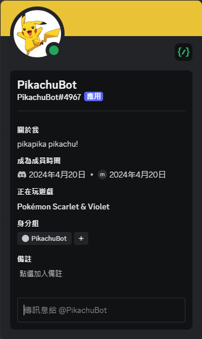
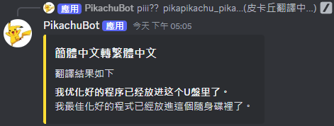
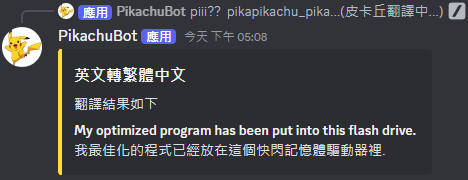
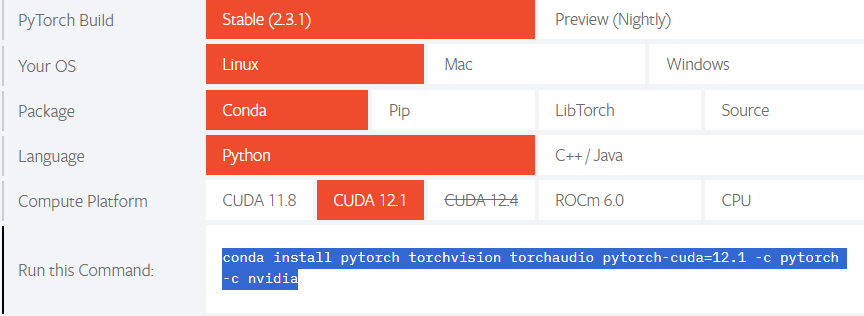
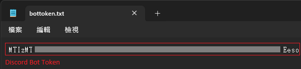
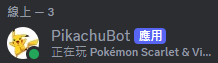

# PikachuBot
這是一款有著皮卡丘外觀，並模仿著皮卡丘行為，但卻有著許多有趣功能的Discord Bot。  


內建寶可夢圖鑑功能


能夠解決你三餐的煩惱


可以新增你與朋友們喜歡的餐廳


也能夠執行翻譯工作(目前僅支援中文與英文)



## Description
這個discord機器人提供了一些趣味性的功能
> 例如 : 讓皮卡丘使用各種招式、辨識寶可夢的類別等...

同時也支援了一些便利的斜線指令
> 例如 : 吃什麼?、分組等...

## Requirements
### Step 1. 建立Discord Bot
首先需要有一個Discord帳號  
[Discord 官方網站](https://discord.com/)

接著到Discord Developer建立Bot並取得邀請連結與Token  
[Discord Developer](https://discord.com/developers/docs/intro)

> * 建立機器人步驟如下
>   * 到Discord Developer
>   * 點擊左側列表的"Applications"(若尚未登入會請你先登入)
>   * 點擊右上角的"New Application"，填寫應用程式名稱並按下"Create"
>   * 點擊左側列表的"Bot"，可以為你的機器人設定"USERNAME"與大頭照
>   * 點擊"Reset Token"，點擊"Yes, do it!"
>   * 輸入密碼後，點選"Copy"(請記下Token)
>   * 開啟"Privileged Gateway Intents"的所有選項，並"Save Change"
>   * 點擊左側列表的"OAuth2"，找到"OAuth2 URL Generator"
>   * 在"SCOPES"區塊中點選"bot"
>   * 最下方出現"GENERATED URL"，透過這個連結邀請機器人進伺服器

### Step 2. 建立Firebase Firestore
首先到Firebase網站，點擊"Get Start"進入控制台，建立Firestore並取得private key。  
[Firebase官方網站](https://firebase.google.com/)

> * 建立Firestore的步驟如下
>   * 在Firebase控制台點擊"Create a project"或"Add project"
>   * 填寫專案名稱並繼續
>   * 是否啟用Google Analytics自行決定，我這邊選擇啟用
>   * 建立完成後點擊"Build">"Firestore Database">"Create database"
>   * "Location"可以選擇你的資料庫要架在哪裡的伺服器
>   * Secure rules的部分建議選擇"test mode"，後續都可以再修改
>   * 接著點擊"Create"建立資料庫
>   * 在資料庫上方欄位選擇"Rules"
>   * 找到以下這行，可以設定資料庫的存取有效期限(預設期限為一個月後)
>       ```資料庫存取有效期限設定
>       allow read, write: if request.time < timestamp.date(2024, 8, 12);
>       ```
>   * 這邊根據自己的需求調整，我選擇直接不設定期限
>       ```資料庫存取無期限設定
>       allow read, write;
>       ```
>   * 設定期限後點擊"Publish"儲存
>   * 接著找到左側列表最上方的"Project Overview"，點擊右側的齒輪，選擇"Project settings"
>   * 在上方欄位點選"Service accounts"
>   * 找到"Admin SDK configuration snippet"，點選"Python">"Generate new private key"
>   * 接著會產生一個json檔，就是這個專案的private key，請將它保存好

### Step 3. 安裝模組
> 如果你使用docker來運行的話可以直接跳過這個步驟  
> 否則以下步驟皆在conda虛擬環境中進行

首先請先安裝pytorch  
[Pytorch 官方網站](https://pytorch.org/)

根據自身電腦配備執行對應指令  


接著下載這個專案
```download project
git clone https://github.com/ZackChen1140/PikachuBot.git
```

到專案資料夾內執行以下指令，安裝專案所需要的模組與套件
> Windows使用者請先到requirements.txt內將OpenCC==1.1.5更改為OpenCC
```install requirements
pip install -r requirements.txt
```

## Settings
1. 請在專案資料夾中建立"bottoken.txt"檔案，並將Discord Bot的Token貼到文件檔中。  
    > 請注意"bottoken.txt"必須與"PikachuBot.py"在同一層目錄下

    

2. 將firebase的private key檔案(.json)也放到專案資料夾中
    > 請注意private key檔案必須與"PikachuBot.py"在同一層目錄下

3. 進入專案內的cogs資料夾，建立"datas"資料夾，並將以下Google雲端硬碟內的檔案下載到"datas"中。  
[Google雲端硬碟](https://drive.google.com/drive/folders/1Clg6uSpv8Y1anP_TN_G6X5Q8_Ca4nTtr?usp=drive_link)

## Launch Bot
### Conda
開啟Anaconda Prompt，進入本專案的資料夾，執行下列指令即可
```run bot
python PikachuBot.py
```

### Docker
1. 開啟終端機，進入本專案的資料夾，執行下列指令建立image
    > 請將{your_image_name}替換為你想取的image名稱
    ```build image
    docker build -t {your_image_name} .
    ```
2. 接著執行下列指令建立container
    > 請將{your_container_name}替換為你想取的container名稱，{your_image_name}需與前一步指令的{your_image_name}相同。
    ```run container
    docker run -d -P --name {your_container_name} {your_image_name}
    ```

### Waiting for bot online
回到Discord伺服器內，看到bot上線就成功囉~  
